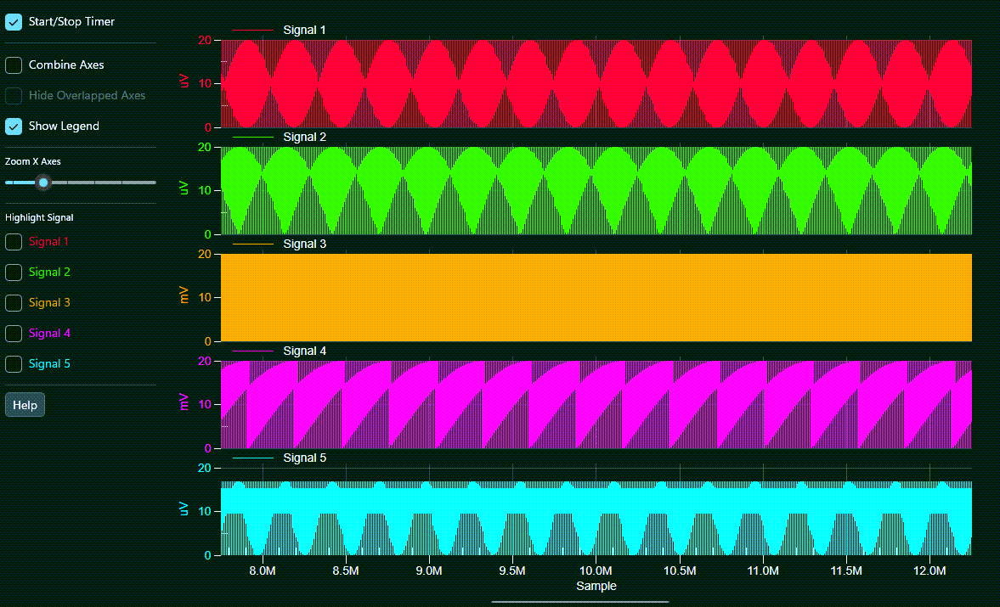

# GigaPrime2D WinUI — 100 Million Point WinUI Chart

A ProEssentials v11 WinUI 3 .NET 10 demonstration of GPU compute shader rendering — 
100 million data points completely re-passed and re-rendered per timer tick.
Live FPS displayed in the title bar.



---

> **Found ProEssentials through this repo?** Use code **GITHUB15_OCT31** at checkout for 15% off your first license.
>
> Thanks for sharing — every share and star helps another engineer find this repo.

---

## What This Demonstrates

GigaPrime2D WinUI demonstrates ProEssentials v11 GPU compute shader rendering of
100 million data points per update in a WinUI 3 .NET 10 application.

- **5 subsets × 20,000,000 points = 100M data points per update**
- **GPU compute shaders** process all data in parallel on the GPU
- **Zero memory copy** — chart receives a pointer to `fYDataToChart` directly
  via `UseDataAtLocation`. Changing the array contents is all that is needed
  to update the chart.
- **Live FPS counter** displayed in the window title bar

---

## How It Works

### Data Architecture

```csharp
// 120M point pool — prepared once at startup
float[] fYDataPool = new float[120010000];

// 100M point buffer — pointer passed directly to chart
// Chart forwards this to GPU compute shaders each render
float[] fYDataToChart = new float[100000000];
```

On each timer tick, `Array.Copy` moves 100M points from a random offset
in `fYDataPool` into `fYDataToChart` producing variation. The chart renders
the new data immediately via GPU compute shaders.

### GPU Compute Shader Settings

```csharp
// builds the scene on the GPU vs CPU
Pesgo1.PeData.ComputeShader  = true;  // GPU-side chart construction
Pesgo1.PeData.Filter2D3D     = true;  // set with ComputeShader + Line plotting
Pesgo1.PeData.StagingBufferY = true;  // always set for ComputeShader
Pesgo1.PeData.StagingBufferX = true;  // always set for ComputeShader
```

### Five Independent Axes

Each of the 5 signal channels gets its own Y axis lane via `MultiAxesSubsets`.
The UI lets you combine, hide, highlight, and resize axes interactively.

---

## Interface Performance Notes

WinForms has a slight performance edge as Direct3D is directly coupled to the
window device context, avoiding the texture compositing step that WPF and WinUI
require. All three versions use identical GPU compute shaders.

| Version | Render Time | End-to-End FPS |
|---------|-------------|----------------|
| WinForms | ~15ms | ~20 FPS |
| WPF | ~15ms | ~17 FPS |

WinUI composites through a swap chain like WPF, so expect throughput in the same
range — run it and read the title bar for the number on your own hardware.

For maximum real-time throughput see the WinForms version:
➡️ [winforms-chart-100million-points-proessentials](https://github.com/GigasoftInc/winforms-chart-100million-points-proessentials)

---

## Interactive Controls

- **Start/Stop Timer** — enables 100M point continuous re-rendering
- **Mouse wheel** — zooms X axis range
- **Zoom X Axes slider** — programmatic zoom control
- **Combine Axes** — overlaps all 5 signals into one shared graph area
- **Hide Overlapped Axes** — collapses to single combined Y axis label
- **Highlight Signal 1-5** — expands selected channel to 80% of height
- **Show Legend** — toggles legend display
- **Right-click** — full built-in context menu including zoom reset

---

## Prerequisites

- Visual Studio 2026 with the **.NET desktop development** and 
  **Windows application development** workloads
- .NET 10 SDK
- Internet connection for NuGet restore
- Dedicated GPU recommended

> **No XAML designer:** Visual Studio has no XAML designer for WinUI 3 in any
> edition, so the chart is declared in markup rather than dragged from the
> Toolbox. That is a Windows App SDK limitation, not a ProEssentials one.
> Nothing needs to be installed beyond the NuGet packages for this project
> to build and run.

---

## How to Run

```
1. Clone this repository
2. Open GigaPrime2DwinUI.sln in Visual Studio 2026
3. Build → Rebuild Solution (restores NuGet packages automatically)
4. Press F5
5. Check Start/Stop Timer to begin 100M point rendering
6. Watch live FPS in the title bar
```

---

## NuGet Package

This project references
[`ProEssentials.Chart.Net10.WinUI`](https://www.nuget.org/packages/ProEssentials.Chart.Net10.WinUI)
from nuget.org. Package restore happens automatically on build.

The AnyCpu package embeds the native rendering engines inside the assembly and
unpacks the one matching the running process at run time, so there is no native
DLL to copy or deploy alongside your app. It also carries the control's `.pri`,
whose resources are merged into your app's own `.pri` at build time.

The nuget.org package is the evaluation build and draws an "Evaluating
ProEssentials" watermark across the chart. A licensed installation replaces the
assembly and the watermark goes away — performance and behavior are identical.

---

## Deploying a WinUI App

WinUI deploys differently than WPF and WinForms:

- A .NET app is **not a single exe** — ship the entire build or publish output
  folder, never a hand-picked subset.
- The target machine needs **two** runtimes: the .NET 10 Desktop Runtime **and**
  the Windows App SDK Runtime. Or publish self-contained with
  `-p:WindowsAppSDKSelfContained=true`.
- Your development machine already has both, so it will run from an under-filled
  folder. Always validate on a clean machine.

---

## Related

- [WPF version — wpf-chart-fast-100m-points-proessentials](https://github.com/GigasoftInc/wpf-chart-fast-100m-points-proessentials)
- [WinForms version — winforms-chart-100million-points-proessentials](https://github.com/GigasoftInc/winforms-chart-100million-points-proessentials)
- [Plot 100 Million Points — 5-Library Comparison](https://gigasoft.com/blog/plot-100-million-points-winui-comparison)
- [Performance — GPU Architecture Comparison](https://gigasoft.com/why-proessentials/performance)
- [No-hassle evaluation download](https://gigasoft.com/net-chart-component-wpf-winforms-download)
- [gigasoft.com](https://gigasoft.com)

---

## License

Example code is MIT licensed. ProEssentials requires a commercial
license for continued use.
